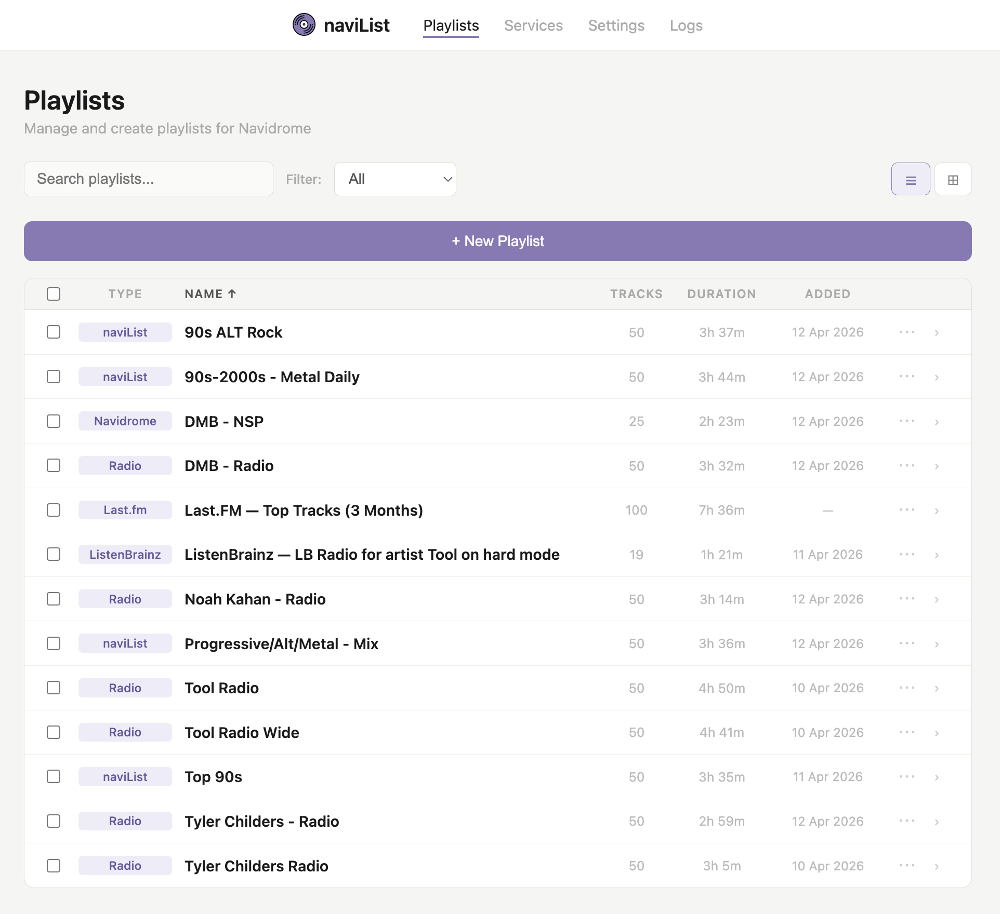

# naviList

Self-hosted playlist manager and generator for [Navidrome](https://www.navidrome.org/). 




## Features
- **naviList playlists** — rules-based generation using stats, tags, artists, decades, and more. Rules are weighted and interleaved, not concatenated. Supports auto-refresh on a cron schedule.
- **Radio style playlists** — seed one or more artists and naviList finds similar music from your library using cached Last.fm similarity data. Adjustable depth (close / medium / wide).
- **Navidrome Smart Playlists (NSP)** — a UI wrapper for Navidrome's native `.nsp` smart playlist format.
- **Manual playlists** — browse your library and build playlists by hand.

## External service integration
- **Last.fm** — syncs listen history, loved tracks, top artists, top tracks, artist tags, similar artists, and chart-based playlists (weekly, monthly, all-time). Subscribe to auto-updating playlists or save point-in-time snapshots.
- **ListenBrainz** — syncs listen history, loved tracks, top artists, top tracks, and generated playlists (Weekly Jams, Weekly Exploration, Daily Jams). Same subscribe/snapshot model as Last.fm.
- **Lidarr** — when a subscribed playlist contains artists not in your library, naviList can automatically queue them in Lidarr for download.

## A.I. Disclosure 
Coding agents were used extensively for the development of this project with oversight and understanding of all core functions. The developer is committed to actively maintaining and improving the project. 

## Quick start

### 1. docker-compose.yml

```yaml
services:
  navilist:
    image: ghcr.io/your-username/navilist:latest
    container_name: navilist
    restart: unless-stopped
    ports:
      - "3000:3000"
    volumes:
      - ./data:/app/data          # SQLite DB and artist images
      - ./nsp:/nsp                # NSP playlist output — must match Navidrome's PlaylistsPath
    environment:
      - PORT=3000
      - LOG_LEVEL=info
    healthcheck:
      test: ["CMD", "wget", "-qO-", "http://localhost:3000/health"]
      interval: 30s
      timeout: 5s
      retries: 3
      start_period: 10s
```

### 2. Environment variables

| Variable | Default | Description |
|---|---|---|
| `PORT` | `3000` | HTTP port naviList listens on |
| `LOG_LEVEL` | `info` | Log verbosity: `debug`, `info`, `warn`, `error` |
| `DB_PATH` | `/app/data/navilist.db` | Path to the SQLite database file |
| `NAVIDROME_URL` | — | Navidrome base URL e.g. `http://navidrome:4533` |
| `NAVIDROME_USER` | — | Navidrome username |
| `NAVIDROME_PASSWORD` | — | Navidrome password |
| `MUSIC_FOLDER_IDS` | — | Comma-separated Navidrome music folder IDs to restrict sync to |
| `LASTFM_API_KEY` | — | Last.fm API key |
| `LASTFM_USERNAME` | — | Last.fm username |
| `LISTENBRAINZ_TOKEN` | — | ListenBrainz user token |
| `LISTENBRAINZ_USERNAME` | — | ListenBrainz username |
| `LIDARR_URL` | — | Lidarr base URL e.g. `http://lidarr:8686` |
| `LIDARR_API_KEY` | — | Lidarr API key |
| `LIDARR_ROOT_FOLDER` | — | Lidarr root folder path e.g. `/music` |
| `LIDARR_QUALITY_PROFILE_ID` | — | Lidarr quality profile ID |
| `LIDARR_METADATA_PROFILE_ID` | — | Lidarr metadata profile ID |
| `NL_NSP_PATH` | — | Path inside the container where `.nsp` files are written |

### 3. Navidrome configuration

For NSP playlists to work, Navidrome must be pointed at the same directory naviList writes `.nsp` files to with proper permissions configured. In your Navidrome config:

```toml
PlaylistsPath = /music/playlists
```

Mount the same path in both containers so they share the directory.

Example Navidrome compose section

```yaml
    volumes:
      - ./music:/music:ro
      - ./nsp:/music/playlists
    environment:
      - ND_PLAYLISTSPATH=/music/playlists
```

In naviList Settings, set the NSP output path to `/nsp`.

## Building from source

```bash
git clone https://github.com/your-username/navilist.git
cd navilist
npm install
```

### Development

```bash
npm run dev
```

Runs with `nodemon` — restarts automatically on file changes. Server starts on `http://localhost:3000`.

### Production

```bash
npm start
```

### Docker build

```bash
docker build -t navilist .
```


## First run

1. Open `http://localhost:3000` — you'll land on the Playlists page.
2. Go to **Settings** and configure Navidrome credentials. Hit **Test Connection**.
3. Go to **Services** and hit **Sync Library** to pull your Navidrome library into naviList's local database.
4. Optionally configure Last.fm, ListenBrainz, and Lidarr in Settings.
5. Go to **Services** and run **Sync All** for any connected services.
6. Create your first playlist from the Playlists page.

After initial setup, naviList polls Navidrome for library changes every 5 minutes and runs a full external service sync every 30 minutes automatically.


## Project structure

```
src/
  server.js           — entry point, route mounts, startup
  db/
    index.js          — DB initialisation
    schema.js         — full schema (all tables)
  lib/
    playlists.js      — playlist CRUD routes
    pl_engine.js      — rules-based playlist generation engine
    nsp.js            — NSP filesystem routes
    settings.js       — settings save/load routes
    status.js         — services status route
    logs.js           — log streaming route
    sync/
      index.js        — sync orchestration, auto-refresh, cron scheduling
      listenbrainz.js — ListenBrainz sync jobs
      lastfm.js       — Last.fm sync jobs
      helpers.js      — shared sync utilities
  providers/
    navidrome.js      — Navidrome / Subsonic API
    lastfm.js         — Last.fm API
    listenbrainz.js   — ListenBrainz API
    lidarr.js         — Lidarr API
    musicbrainz.js    — MusicBrainz API
    deezer.js         — Deezer API (artist images)
public/
  playlists.html      — main UI
  settings.html       — settings UI
  status.html         — services UI
  css/main.css        — all styles
  assets/
```

## License

GPL 3.0
