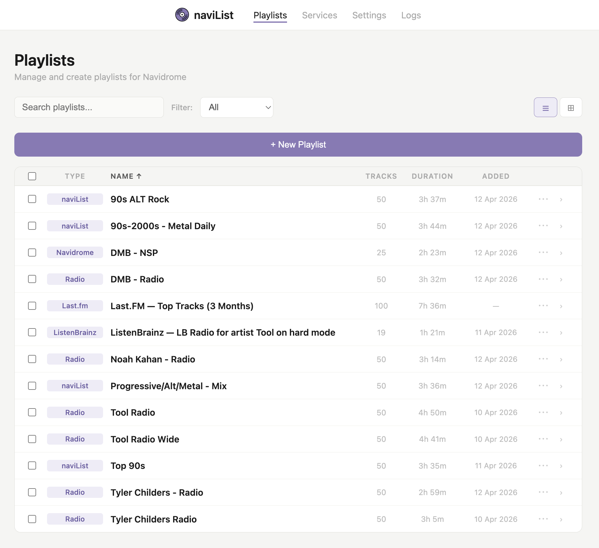

# naviList

Self-hosted playlist manager and generator for [Navidrome](https://www.navidrome.org/).

**Documentation:** [naviList Wiki](https://github.com/ofernander/naviList/wiki) - setup, every feature explained, and troubleshooting.



## What it is

- **Non A.I. dependent playlist generator** - No A.I. agent required (or even available), playlists are generated from database queries and clever rule sets
- **Playlist manager** - Manage Navidrome playlists including Navidrome Smart Playlists.
- **Playlist creator** - Create Navidrome playlists from tracks already present in your library based on rule based generation or from external services listed below.
- **Playlist importer** - Import external playlists from outside sources into Navidrome, matching against tracks you already have in your library.

## What it is not

- **Media discovery service** - naviList aims to be a playlist manager/creator only, there are many services/projects already for discovering new media.
- **Media downloader** - naviList has no ability to download new music directly. It can send missing artist to Lidarr from an imported playlist but will not build playlist from tracks not present in your library. 

## Features
Check out more details in the [wiki](https://github.com/ofernander/naviList/wiki).

- **naviList playlists** - In house rules-based generation using stats, tags, genres, artists, decades, etc... 
  - **Similar artists (radio)** - add an Artist rule and set its Similar option (close / medium / wide) to include similar artists from your library using Last.fm similarity data. Combine with other rules, e.g. Artist = Tool + Similar + Decade = 1990s.
  - **Popularity** - Tracks are rated by how popular they are within their artist, from ListenBrainz play counts (needs your ListenBrainz token) with Last.fm (needs an API key) as a fallback. A Popularity condition splits a block, or a whole playlist, into hits, album tracks and deep cuts by percentage, e.g. 90s alternative rock but only the hits. Tracks without a rating count as deep cuts.
  - **Studio / Live** - Studio recordings are preferred when your library holds more than one copy of a song. A Studio / Live condition sets how much of a block, or a whole playlist, can be live recordings. New naviList playlists start with it set to 100% studio.
  - **Editing and regenerating** - Edit rules reopens the same builder used to create the playlist, with its current rules as the starting point and a preview before you save. Regenerate rebuilds a rules playlist from its rules, so it can add new tracks and replace ones currently on it.
- **Navidrome Smart Playlists (NSP)** - a UI wrapper for Navidrome's native `.nsp` smart playlist format.
- **Manual playlists** - browse your library and build playlists by hand.
- **Import playlists** - Import external playlist, support for m3u, JSPF, [exportify.net](https://exportify.net) CSV, naviList CSV, naviList JSON. Imports are matched against your library with a fuzzy fallback: close matches get a dropdown of candidate songs with a confidence score, so you can review them before saving. The minimum confidence is set in Settings (Fuzzy match threshold, default 80).
- **Cron Scheduling** - All playlist support Cron scheduling. Use case would be daily generation of playlist for daily variety. 
- **Themes** - Auto, light or dark, from the selector in the navigation bar.

## External service integration
- **Last.fm** - syncs listen history, loved tracks, top artists, top tracks, artist tags, similar artists, and chart-based playlists (weekly, monthly, all-time). Subscribe to auto-updating playlists or save point-in-time snapshots. Also used as a popularity source when no ListenBrainz data is available.
- **ListenBrainz** - syncs listen history, loved tracks, top artists, top tracks, and generated playlists (Weekly Jams, Weekly Exploration, Daily Jams). Same subscribe/snapshot model as Last.fm. Also the main popularity source and the default source for similar artists (similar artists need no key).
- **Maloja** - self-hosted scrobbler integration. Syncs listen history, top artists, and top tracks from your own [Maloja](https://github.com/krateng/maloja) instance. Configured via URL and API key.
- **Spotify/Exportify** - Spotify cannot be directly integrated at this time. Spotify playlist can be imported via the third party exporter [exportify.net](https://exportify.net). Further Spotify support will not be pursued due to their API restrictions & cost. 
- **Lidarr** - when a subscribed playlist contains artists not in your library, naviList can automatically queue them in Lidarr for download.

## A.I. Disclosure 
Coding agents were used for the development of this project with human oversight and understanding of all core functions.

## Input welcome
If there's an external playlist source/format and you want to add it to naviList please open an issue to request or even better a PR to add it! 

## Quick start

### 1. docker-compose.yml

```yaml
services:
  navilist:
    image: ghcr.io/ofernander/navilist:latest
    container_name: navilist
    restart: unless-stopped
    ports:
      - "3000:3000"
    volumes:
      - ./data:/app/data
      - ./nsp:/nsp                # NSP playlist output - must match Navidrome's PlaylistsPath
    environment:
      - PORT=3000
      - LOG_LEVEL=info
    healthcheck:
      test: ["CMD", "wget", "-qO-", "http://localhost:3000/health"]
      interval: 30s
      timeout: 5s
      retries: 3
      start_period: 10s
```

### 2. Environment variables

| Variable | Default | Description |
|---|---|---|
| `PORT` | `3000` | HTTP port naviList listens on |
| `LOG_LEVEL` | `info` | Log verbosity: `debug`, `info`, `warn`, `error` |
| `DB_PATH` | `/app/data/navilist.db` | Path to the SQLite database file |
| `NAVIDROME_URL` | - | Navidrome base URL e.g. `http://navidrome:4533` |
| `NAVIDROME_USER` | - | Navidrome username |
| `NAVIDROME_PASSWORD` | - | Navidrome password |
| `MUSIC_FOLDER_IDS` | - | Comma-separated Navidrome music folder IDs to restrict sync to |
| `LASTFM_API_KEY` | - | Last.fm API key |
| `LASTFM_USERNAME` | - | Last.fm username |
| `LISTENBRAINZ_TOKEN` | - | ListenBrainz user token |
| `LISTENBRAINZ_USERNAME` | - | ListenBrainz username |
| `MALOJA_URL` | - | Maloja base URL e.g. `http://maloja:42010` |
| `MALOJA_API_KEY` | - | Maloja API key |
| `LIDARR_URL` | - | Lidarr base URL e.g. `http://lidarr:8686` |
| `LIDARR_API_KEY` | - | Lidarr API key |
| `LIDARR_ROOT_FOLDER` | - | Lidarr root folder path e.g. `/music` |
| `LIDARR_QUALITY_PROFILE_ID` | - | Lidarr quality profile ID |
| `LIDARR_METADATA_PROFILE_ID` | - | Lidarr metadata profile ID |
| `NL_NSP_PATH` | - | Path inside the container where `.nsp` files are written |

### 3. Navidrome configuration

For NSP playlists to work, Navidrome must be pointed at the same directory naviList writes `.nsp` files to with proper permissions configured. In your Navidrome config:

```toml
PlaylistsPath = /music/playlists
```

Mount the same path in both containers so they share the directory.

Example Navidrome compose section

```yaml
    volumes:
      - ./music:/music:ro
      - ./nsp:/music/playlists
    environment:
      - ND_PLAYLISTSPATH=/music/playlists
```

In naviList Settings, set the NSP output path to `/nsp`.

## Building from source

```bash
git clone https://github.com/ofernander/navilist.git
cd navilist
npm install
```

### Development

```bash
npm run dev
```

Runs with `nodemon` - restarts automatically on file changes. Server starts on `http://localhost:3000`.

### Production

```bash
npm start
```

### Docker build

```bash
docker build -t navilist .
```


## First run

The [Getting Started](https://github.com/ofernander/naviList/wiki/Getting-Started) page in the wiki covers this in more detail.

1. Open `http://localhost:3000` - you'll land on the Playlists page.
2. Go to **Settings** and configure Navidrome credentials. Hit **Test Connection**.
3. Go to **Services** and hit **Sync Library** to pull your Navidrome library into naviList's local database.
4. Optionally configure Last.fm, ListenBrainz, and Lidarr in Settings.
5. Go to **Services** and run **Sync All** for any connected services.
6. Create your first playlist from the Playlists page.

After initial setup, naviList polls Navidrome for library changes every 5 minutes and runs a full external service sync every 30 minutes automatically.


## Project structure

```
src/
  server.js                - entry point, route mounts, startup
  db/
    index.js               - DB initialisation
    schema.js              - full schema (all tables) and startup migrations
    settings.js            - settings accessor (settings table -> object)
  lib/
    playlists.js           - playlist routes (list, detail, edit, save, delete, export)
    pl_engine.js           - rules playlist engine: blocks, conditions, shares
    playlist_types.js      - playlist types, rules config format, readable descriptions
    match.js               - the one matcher: external track -> library track
    finalize.js            - clean-up, artist spread and block mixing for generated playlists
    publish.js             - the single write path to Navidrome and the registry
    refresh.js             - cron schedules and regeneration of rules playlists
    studio.js              - studio vs live recording choice
    popularity.js          - per-artist track popularity ratings
    similar.js             - similar-artist lookups (ListenBrainz, Last.fm)
    artist_mbid.js         - MusicBrainz artist IDs for the library
    live_fill.js           - marks live recordings from MusicBrainz live releases
    ingestion.js           - listen history ingestion pipeline
    external_playlists.js  - ListenBrainz and Last.fm playlist routes
    library.js             - library browsing routes (artists, albums, tracks, cover art)
    nsp.js                 - Navidrome Smart Playlist (.nsp) routes
    settings.js            - settings save/load routes
    status.js              - services status route
    logs.js                - log viewing routes
    sync/
      index.js             - sync orchestration and background job scheduling
      listenbrainz.js      - ListenBrainz sync jobs
      lastfm.js            - Last.fm sync jobs
      maloja.js            - Maloja sync jobs
      musicbrainz.js       - MusicBrainz sync jobs
      helpers.js           - shared sync utilities
  providers/
    navidrome.js           - Navidrome / Subsonic API
    lastfm.js              - Last.fm API
    listenbrainz.js        - ListenBrainz API
    maloja.js              - Maloja API
    lidarr.js              - Lidarr API
    musicbrainz.js         - MusicBrainz API
    deezer.js              - Deezer API (artist images)
  utils/
    logger.js              - logging
public/
  playlists.html           - playlists UI and rules builder
  library.html             - library browser and manual playlists
  settings.html            - settings UI
  status.html              - services UI
  logs.html                - logs UI
  404.html                 - not found page
  css/main.css             - all styles
  js/theme.js              - light / dark / auto theme
  assets/                  - icons and images
```

## License

GPL 3.0
